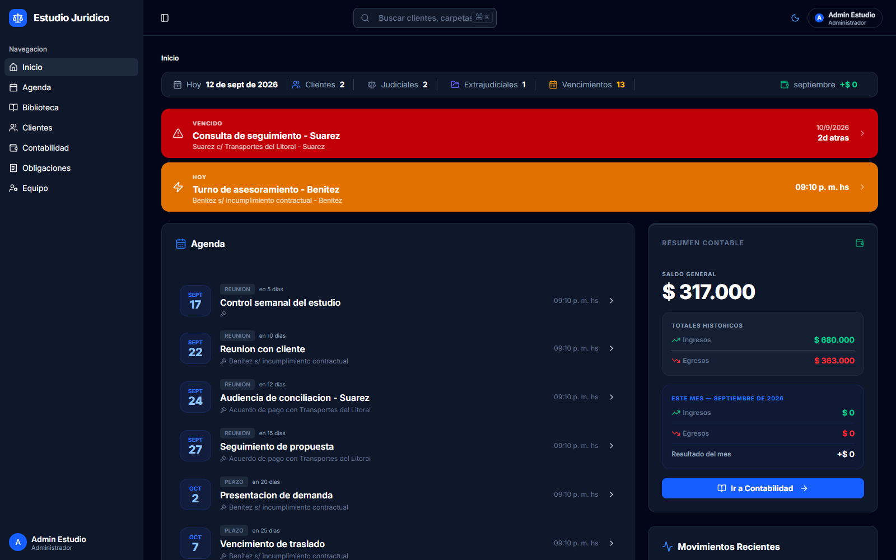
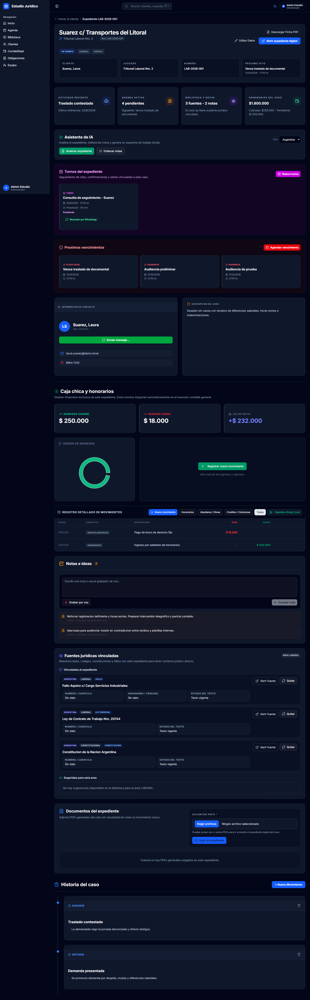

# LegalManager — Sistema de Gestión Jurídica Integral

Plataforma full-stack para la administración integral de estudios jurídicos, con enfoque internacional y adaptable a distintas jurisdicciones (Argentina y Paraguay), materias y formas de trabajo.

> **Demo en vivo:** [gestion-estudio-juridico.vercel.app](https://gestion-estudio-juridico.vercel.app/)

## Funcionalidades

- **Gestión de clientes y expedientes:** seguimiento de causas judiciales y extrajudiciales, con historial cronológico de movimientos y semáforo de vencimientos.
- **Biblioteca jurídica vinculada:** leyes, códigos y fallos asociados a cada expediente, con validación automática de fuentes legales oficiales por país (InfoLEG en Argentina; CSJ, BACN y Gaceta Oficial en Paraguay).
- **Asistencia con IA:** análisis comparativo de textos normativos mediante Google Gemini.
- **Control financiero:** registro de ingresos y gastos por expediente, visualización del progreso de cobro de honorarios.
- **Agenda inteligente:** alertas de plazos fatales, audiencias y compromisos.
- **Control de acceso por roles:** administrador, abogado y cliente, con autenticación mediante Auth.js (NextAuth v5).

## Stack

- **Frontend:** Next.js 16, React, TypeScript
- **Estilos:** Tailwind CSS, Shadcn/ui
- **Backend:** Server Actions
- **Base de datos:** PostgreSQL
- **ORM:** Prisma
- **Autenticación:** Auth.js (NextAuth v5)
- **IA:** Google Gemini

## Estado

En fase operativa, con la base principal consolidada y en expansión continua de módulos jurídicos, contables y de análisis.

## Contacto

Franco Cuscianna — [LinkedIn](https://linkedin.com/in/francocus) — cusciannafranco@gmail.com
