# Sistema de Gestión Jurídica Integral

Plataforma full-stack para la administración integral de estudios jurídicos, con enfoque internacional y adaptable a distintas jurisdicciones (Argentina y Paraguay), materias y formas de trabajo.

> **Demo en vivo:** [gestionlegal.studio](https://www.gestionlegal.studio/)

## Funcionalidades

### Gestión de clientes

Cartera de clientes con ficha individual, datos de contacto, expedientes asociados y vista rápida de los turnos del día.

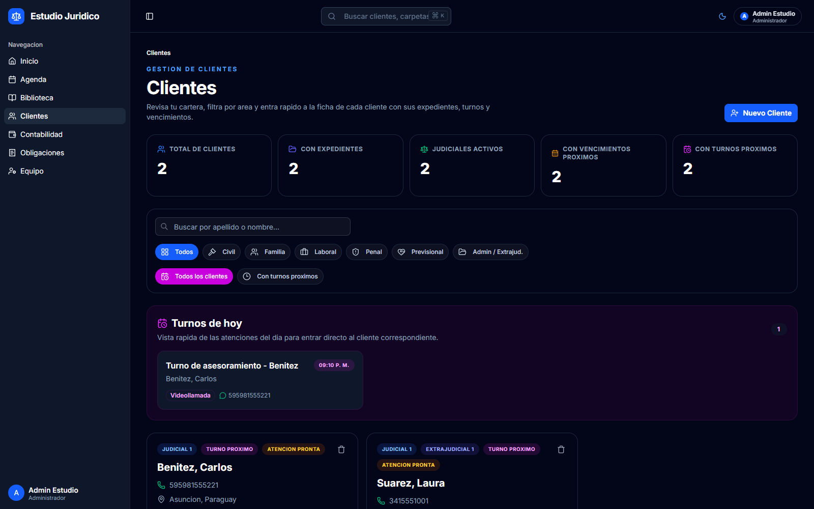

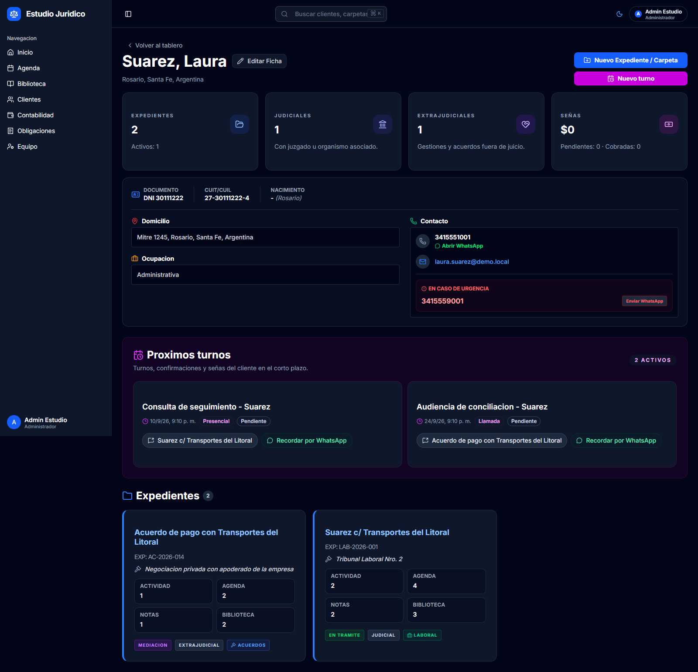

### Expedientes judiciales y extrajudiciales

Seguimiento de causas con historial cronológico de movimientos, notas, documentación adjunta, biblioteca vinculada y semáforo de vencimientos.

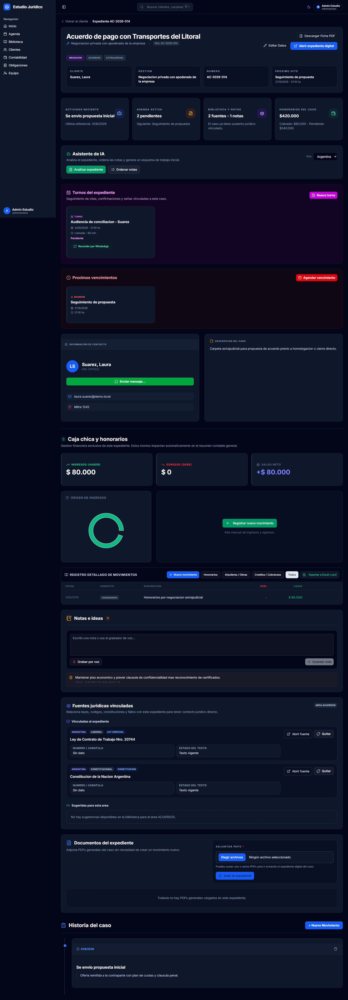

### Agenda y turnos

Organización de vencimientos, audiencias, reuniones y turnos, con alertas de plazos y bandeja operativa filtrable.

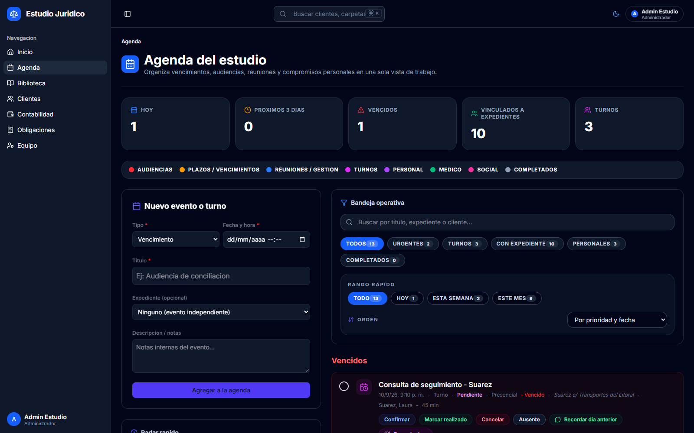

### Control financiero

Registro de ingresos y gastos por expediente, contabilidad general y visualización del flujo de caja.

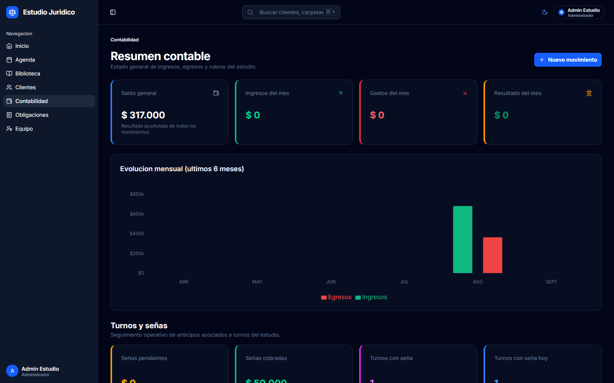

### Obligaciones

Seguimiento impositivo y administrativo del estudio, con vencimientos, pagos y presentaciones.

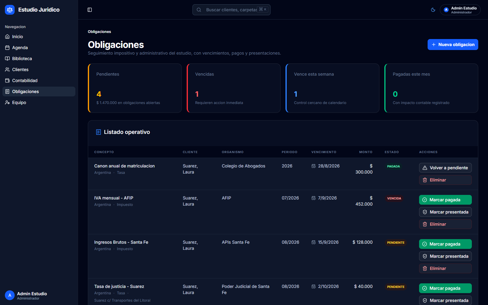

### Biblioteca jurídica y verificación con IA

Leyes, códigos y fallos asociados a cada expediente, con validación automática de fuentes oficiales por país (InfoLEG en Argentina; CSJ, BACN y Gaceta Oficial en Paraguay) y análisis comparativo de textos normativos mediante Google Gemini.

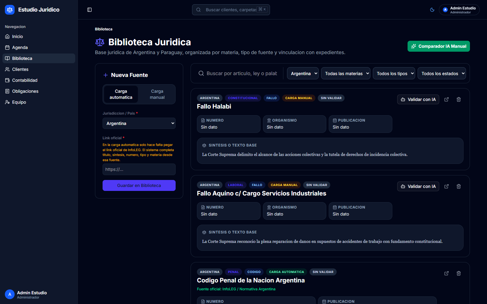

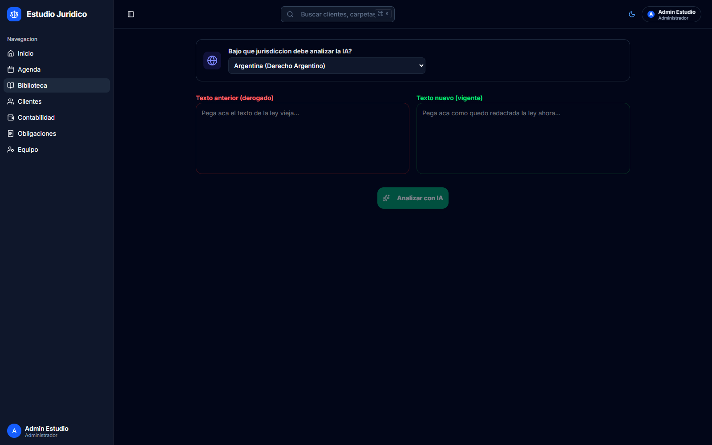

### Equipo, roles y acceso

Control de acceso por roles (administrador, abogado y cliente) con autenticación mediante Auth.js (NextAuth v5), gestión de equipo y auditoría de accesos.

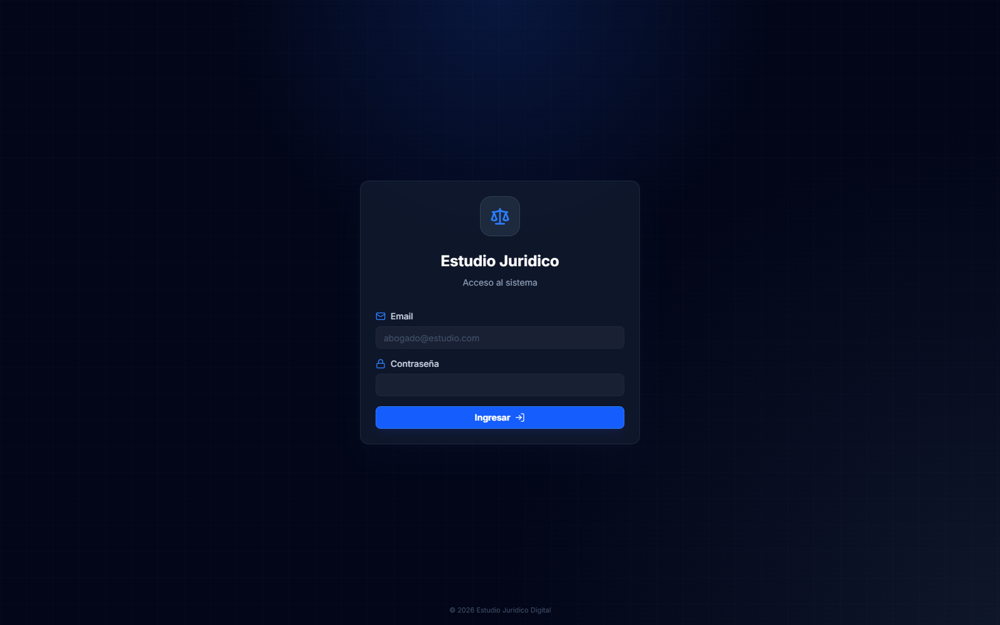

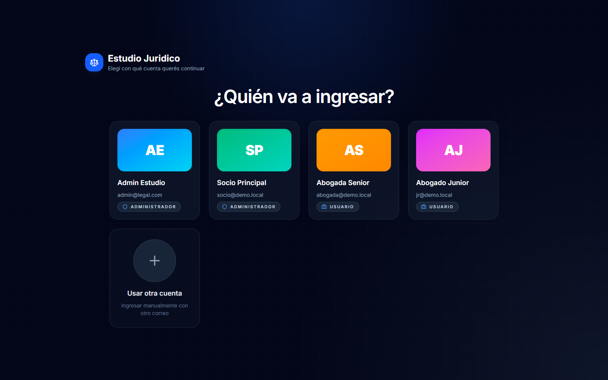

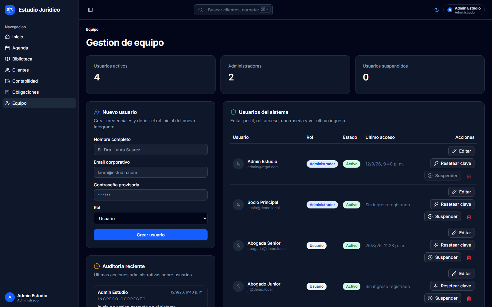

## Stack

- **Frontend:** Next.js 16, React, TypeScript
- **Estilos:** Tailwind CSS, Shadcn/ui
- **Backend:** Server Actions
- **Base de datos:** PostgreSQL
- **ORM:** Prisma
- **Autenticación:** Auth.js (NextAuth v5)
- **IA:** Google Gemini

## Estado

En fase operativa, con la base principal consolidada y en expansión continua de módulos jurídicos, contables y de análisis.

## Contacto

Franco Cuscianna — [LinkedIn](https://linkedin.com/in/francocus) — cusciannafranco@gmail.com
